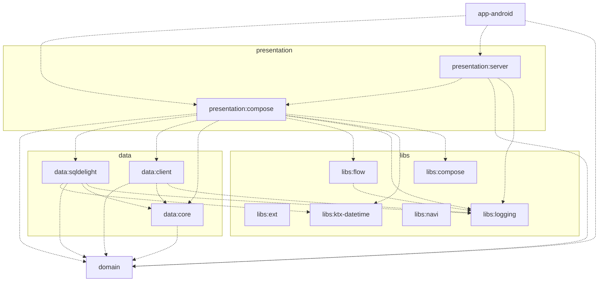
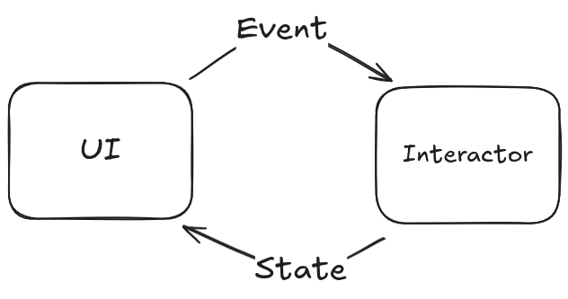

# lift-bro
Lift Bro

Lift Bro is a Lift tracking app created as a side project to help me replace my notebook at the Gym.

It is built using Kotlin Multiplatform and Jetpack Compose Multiplatform to allow for shared logic between Android and iOS

[](https://ko-fi.com/B0B71MI0CT)

# Architecture



- app-*
- presentation
- domain
- data
- libs

#### App-*
These are the application modules. These house the application specific logic (mostly configuration) They then "glue" the other modules together.

#### Presentation
This holds and is responsible for anything directly user facing. This could include things like:

- The UI Composables alongside their UI logic. (the compose module), more details located below.
- An API service that exposes JSON models for other instances of liftbro to consume (the server module)

Responsible for fetching the domain models and mapping them to what is required by that module can understand.

#### Domain
Holds the dependency-free Domain models that are mapped to and from both the Presentation and Data Models
Holds interfaces that define the repositories and methods that the presentation layer can use to fetch the required domain models

#### Data
Holds the implementation of the repositories defined in the domain layer and the implementation details of a datasource ex:
- a local database, SQLDelight 
- a Ktor Client that can connect to a server

Responsible for fetching the data from the source as well as map from the Data models (ie. database entities) to the Domain Models

#### Libs

Any extra libraries that could be used across all layers. Or things that I may be looking to extract and provide via maven

## Presentation MVI Structure



## Dependencies!
Lift Bro started out as a side project where I also wanted to tinker with replacing some of the "standard" libraries for android development

A few things you will not find in the project:

1. ViewModels (at least not the androidx variant)
2. Dependency Injection

### Why no ViewModels?
ViewModels were designed as a requirement for maintaining state when a Fragment was no longer on the stack (or configuration changes) Since this app is fully JetpackCompose and the "state" is handled in either the view or the local DB (ie. there are no network calls) I took this as an opportunity to make something completely different!

What this has resulted in is "bloating" the Composable with business logic which I dont love so this will be refactored as I go forward. But in general the saveStateHandler is utilized to store UI state and then any extra state is fetched from the DB when needed!

The goal being a truely MVI system that stores and UI state in the handler and any side effects handle the work required.

Problems with the current setup:
1. Ive been trying new stuff on each page so there is no "consistency" (side projects amiright!)
2. The view cannot handle long lived tasks very well, storing and maintaining state works fine! But as of right now any long lived tasks (ie. backup/restore or saving to the DB) are treated as "fire and forget"

### Why no "standard" Dependency Injection (ie. Dagger)
(you will start to see a pattern here)

Due to this being a side project I decided to try rolling my own dependency injection scheme. The current implementation is messy to say the least! But a refactor is coming

Problems with the current setup:
1. Stores context statically
2. Easy to inject in a non testable way

# Release Schedule

## Android
Android is released to `open testing` whenever code is pushed to `main`. This can be accessed by opting into the Play Store Beta Public Beta

This beta build is promoted to production every Saturday at midnight!

## iOS
Currently iOS is very manual, I tried to "vibe code" a CI solution similar to android but it failed miserably...

Need to spend some time on this in the future. Until then! Manual (I try to release once a week same as android)

### Goal for iOS
Release to testflight nightly, promote to production every Saturday at midnight

# UI Testing
ui tests are run using maestro, to install follow this link

https://docs.maestro.dev/getting-started/installing-maestro

To run the ui tests you can then run it will target whatever currently running/connected device you have
```bash
maestro test .maestro
```

you can also target a specific flow:
```bash
maestro test .maestro/onboarding_tests.yaml
```

## Local configuration

Environment variables used at build/runtime (via BuildKonfig or Gradle properties):
- LIFT_BRO_ADMOB_APP_ID
- LIFT_BRO_AD_UNIT_ID
- LIFT_BRO_SENTRY_DSN
- REVENUE_CAT_API_KEY

Android release signing (for release builds):
- STORE_PASSWORD
- KEY_ALIAS
- KEY_PASSWORD
