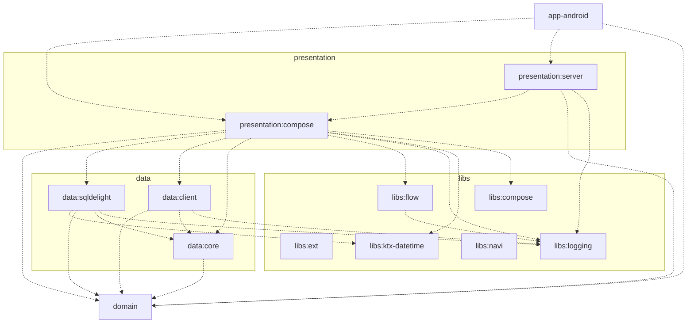

# lift-bro
Lift Bro

Lift Bro is a Lift tracking app created as a side project to help me replace my notebook at the Gym.

It is built using Kotlin Multiplatform and Jetpack Compose Multiplatform to allow for shared logic between Android and iOS

# Architecture

Diagram generated using `./gradlew generateArchDiagrams`

```mermaid
graph TD
  subgraph data
    data:client
    data:core
    data:sqldelight
  end
  subgraph libs
    libs:ext
    libs:logging
    libs:navi
    libs:compose
    libs:flow
    libs:ktx-datetime
  end
  subgraph presentation
    presentation:compose
    presentation:server
  end

 app-android -.-> presentation:compose
 app-android -.-> presentation:server
 app-android -.-> domain
 data:client -.-> domain
 data:client -.-> data:core
 data:client -.-> libs:logging
 data:core -.-> domain
 data:sqldelight -.-> libs:ktx-datetime
 data:sqldelight -.-> domain
 data:sqldelight -.-> data:core
 data:sqldelight -.-> libs:logging
 presentation:compose -.-> domain
 presentation:compose -.-> data:sqldelight
 presentation:compose -.-> data:client
 presentation:compose -.-> data:core
 presentation:compose -.-> libs:flow
 presentation:compose -.-> libs:logging
 presentation:compose -.-> libs:ktx-datetime
 presentation:compose -.-> libs:compose
 presentation:server -.-> presentation:compose
 presentation:server -.-> domain
 presentation:server -.-> libs:logging
 libs:flow -.-> libs:logging

```

- app-*
- presentation
- domain
- data
- libs

#### App-*
These are the application modules. These house the application specific logic (mostly configuration) They then "glue" the other modules together.
The only exception to this is iosApp (where iOS lives)

#### Presentation
This holds and is responsible for anything directly user facing. This could include things like:

- The UI Composables alongside their UI logic. (the compose module), more details located below.
- The State/Events for that ui
- The interactor that handles the given state/event relationship

Responsible for fetching the domain models and mapping them to UI State.

#### Domain
Holds the dependency-free Domain models that are mapped to and from both the Presentation and Data Models
Holds interfaces that define the repositories and methods that the presentation layer can use to fetch the required domain models

#### Data
Holds the implementation of the repositories defined in the domain layer and the implementation details of a datasource ex:
- a local database, SQLDelight 
- a Ktor Client that can connect to a server

Responsible for fetching the data from the source as well as map from the Data models (ie. database entities) to the Domain Models

#### Libs

Any extra libraries that could be used across all layers. Or things that I may be looking to extract and provide via maven

## Dependencies!
Lift Bro started out as a side project where I also wanted to tinker with replacing some of the "standard" libraries for android development

A few things you will not find in the project:

1. ViewModels (at least not the androidx variant)
2. Dependency Injection

### Why no ViewModels?
ViewModels were designed as a solution for maintaining state when a Fragment was no longer on the stack 
(or configuration changes) Since this app is fully JetpackCompose and the "state" is handled in either the view or the local DB 
(ie. there are no network calls) I took this as an opportunity to make something completely different!

The goal being a truely MVI system that stores and UI state in the handler and any side effects handle the work required.

The one major downside of this is any "long lived tasks" that may exist outside of the view state.
These would require reconnection (not possible currently) But the work would still be done (ex: fire and forget events, like saving an object)

### Why no "standard" Dependency Injection (ie. Dagger)
Due to this being a side project I decided to try rolling my own dependency injection scheme. 
The current implementation is messy to say the least! But it does seem to be working

DependencyInjector:
A class that handles all dependency injection, handled statically

Anything that is using a factory/singleton pattern uses lazy injection. 
Anything outside of that (JIT objects) are handled via get() functions

# Release Schedule

## Android
Android is released to `open testing` whenever code is pushed to `main`. This can be accessed by opting into the Play Store Beta Public Beta

This beta build is promoted to production every Saturday at midnight!

## iOS
iOS is built using manual builds for now (pipelines exist but are failing)

### Goal for iOS
Release to testflight nightly, promote to production every Saturday at midnight

# Snapshot testing
Snapshots can be generated using `./gradlew updateScreenshotTests`
Snapshot tests can be validated u sing `./gradlew validateScreenshotTests`

## Local configuration

Environment variables used at build/runtime (via BuildKonfig or Gradle properties):
- LIFT_BRO_ADMOB_APP_ID
- LIFT_BRO_AD_UNIT_ID
- LIFT_BRO_SENTRY_DSN
- REVENUE_CAT_API_KEY

Android release signing (for release builds):
- STORE_PASSWORD
- KEY_ALIAS
- KEY_PASSWORD
