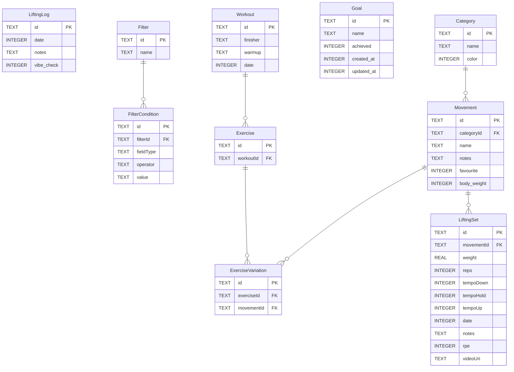

# Database ER Diagram

Generated using `./gradlew :data:sqldelight:generateErDiagram`

```mermaid
erDiagram
    LiftingLog {
        TEXT id PK
        INTEGER date
        TEXT notes
        INTEGER vibe_check
    }
    Workout {
        TEXT id PK
        TEXT finisher
        TEXT warmup
        INTEGER date
    }
    Filter {
        TEXT id PK
        TEXT name
    }
    FilterCondition {
        TEXT id PK
        TEXT filterId FK
        TEXT fieldType
        TEXT operator
        TEXT value
    }
    Goal {
        TEXT id PK
        TEXT name
        INTEGER achieved
        INTEGER created_at
        INTEGER updated_at
    }
    Category {
        TEXT id PK
        TEXT name
        INTEGER color
    }
    Exercise {
        TEXT id PK
        TEXT workoutId FK
    }
    ExerciseVariation {
        TEXT id PK
        TEXT exerciseId FK
        TEXT movementId FK
    }
    Movement {
        TEXT id PK
        TEXT categoryId FK
        TEXT name
        TEXT notes
        INTEGER favourite
        INTEGER body_weight
    }
    LiftingSet {
        TEXT id PK
        TEXT movementId FK
        REAL weight
        INTEGER reps
        INTEGER tempoDown
        INTEGER tempoHold
        INTEGER tempoUp
        INTEGER date
        TEXT notes
        INTEGER rpe
        TEXT videoUri
    }

    Filter ||--o{ FilterCondition : ""
    Workout ||--o{ Exercise : ""
    Exercise ||--o{ ExerciseVariation : ""
    Movement ||--o{ ExerciseVariation : ""
    Category ||--o{ Movement : ""
    Movement ||--o{ LiftingSet : ""
```

